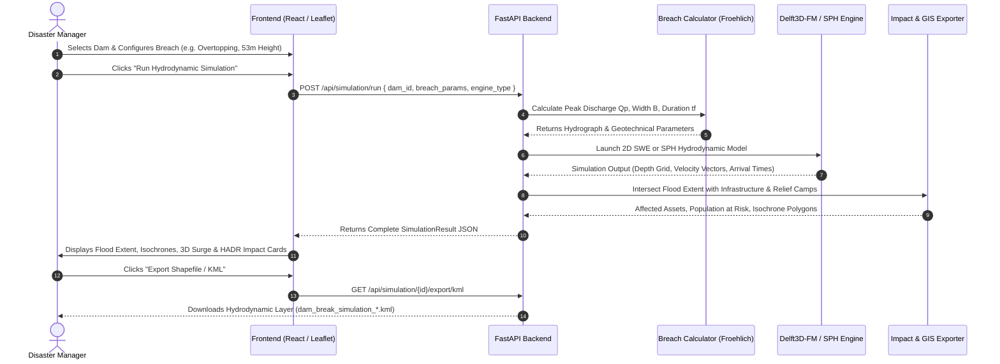

# 🏗️ System Architecture & Data Pipelines
### Dam Break Inundation Modelling & HADR Decision Support Platform (SIH26161)

---

## 📐 1. Architectural Overview

The platform is designed around a decoupled, modular, service-oriented architecture. It isolates compute-heavy hydrodynamic solvers from lightweight geospatial APIs and high-performance interactive visualizers.

```
+---------------------------------------------------------------------------------------------------+
|                                  USER / OPERATOR BROWSER CLIENT                                   |
|                                                                                                   |
|  +-----------------------+  +-----------------------+  +-------------------+  +----------------+  |
|  |     2D GIS Map        |  |   3D Fluid Shock      |  |  HADR Analytics   |  | Scenario Comp  |  |
|  | (Leaflet + GeoTIFF)   |  | (Three.js WebGL)      |  | (Recharts Metrics)|  | Side-by-Side   |  |
|  +-----------^-----------+  +-----------^-----------+  +---------^---------+  +--------^-------+  |
|              |                          |                        |                     |          |
|              +--------------------------+------------------------+---------------------+          |
|                                         |                                                         |
|                             HTTP REST / JSON / GeoJSON                                            |
+-----------------------------------------|---------------------------------------------------------+
                                          v
+---------------------------------------------------------------------------------------------------+
|                              REVERSE PROXY & WEB SERVER (NGINX)                                   |
|                                                                                                   |
|   - Port 80 / 3000: Static Asset Caching (JS, CSS, SVGs, Tiles)                                   |
|   - Location /api/: Reverse Proxies upstream traffic to FastAPI Backend (:8000)                   |
|   - Gzip Compression, CORS Handling, and Rate Protection                                          |
+-----------------------------------------|---------------------------------------------------------+
                                          v
+---------------------------------------------------------------------------------------------------+
|                                FASTAPI APPLICATION BACKEND (:8000)                                |
|                                                                                                   |
|  +---------------------------------------------------------------------------------------------+  |
|  | API Router & Middleware: /api/health, /api/dams, /api/simulation/*, /api/gee/script        |  |
|  +---------------------------------------------------------------------------------------------+  |
|                                                |                                                  |
|  +-----------------------+  +------------------v----+  +-------------------+  +----------------+  |
|  | Scenario Controller   |  | Breach Formulations   |  | In-Memory Store   |  | GIS Exporters  |  |
|  | (Pydantic Validation) |  | (Froehlich 2008 Calc) |  | (Simulation Dict) |  | (KML / SHP)    |  |
|  +-----------+-----------+  +----------+------------+  +---------^---------+  +--------^-------+  |
|              |                         |                         |                     |          |
+--------------|-------------------------|-------------------------|---------------------|----------+
               v                         v                         |                     |
+------------------------------------------------------------------|---------------------|----------+
|                                HYDRODYNAMIC COMPUTATIONAL ENGINES|                     |          |
|                                                                  |                     |          |
|  +-----------------------------------+   +-----------------------v-----------+         |          |
|  | Delft3D Flexible Mesh (D-Flow FM) |   | DualSPHysics (SPH Particle CFD)   |         |          |
|  |  - 2D St. Venant SWE Solver       |   |  - 3D Lagrangian Navier-Stokes    |         |          |
|  |  - Unstructured Mesh Propagation  |   |  - Violent Fluid-Structure Impact |         |          |
|  |  - Downstream Inundation Depth    |   |  - Near-Dam Shock Pressures       |         |          |
|  +-----------------+-----------------+   +-------------------+---------------+         |          |
|                    |                                         |                         |          |
+--------------------|-----------------------------------------|-------------------------|----------+
                     v                                         v                         |
+----------------------------------------------------------------------------------------|----------+
|                                    GEOSPATIAL POST-PROCESSOR                           |          |
|                                                                                        |          |
|  - Inundation Footprint Contours (GeoJSON MultiPolygons)                               |          |
|  - Time-Stepped Wave Front Isochrones (T+0.5h, T+1.0h, T+2.0h, T+4.0h)                 |          |
|  - Critical Infrastructure Spatial Intersection (Shapely Point-in-Polygon)             |          |
|  - Disaster Relief Camp Allocator & Evacuation Routing                                 |          |
+----------------------------------------------------------------------------------------+
```

---

## 📂 2. Backend Module Breakdown

The backend codebase (`backend/`) is structured cleanly to enforce separation of concerns:

### `backend/main.py`
The application entry point and REST API controller:
- Manages CORS headers and middleware.
- Pre-seeds simulation results (`sim-preset-delft3d` and `sim-preset-sph`) for immediate demonstration.
- Exposes endpoints for system health, dam catalogue, simulation execution, scenario comparison, and GIS exports.
- Dynamically falls back to serving compiled frontend static assets for unified single-container deployment.

### `backend/config.py`
Environment configuration:
- Automatically detects binary availability (`DELFT3D_BIN_PATH`, `DUALSPHYSICS_BIN_PATH`).
- Automatically resolves operating mode (`MODE = "REAL"` if binaries exist, else `MODE = "MOCK"`).
- Creates and manages persistent simulation directories (`OUTPUTS_DIR = backend/sim_outputs`).

### `backend/models/schemas.py`
Pydantic v2 data models enforcing strict type contracts:
- `BreachParameters`: Crest height, failure duration, breach width, initial reservoir level, failure mode.
- `SimulationRequest`: Dam identifier, scenario name, engine selection (`DELFT3D_FM` or `SPH`).
- `SimulationResult`: Metadata, peak discharge, flooded area, maximum water depth, time series, isochrone GeoJSON, and impact summaries.
- `ScenarioComparison`: Differential metrics comparing multiple runs.

### `backend/hydro_engine/breach_calc.py`
Implementation of geotechnical dam failure equations:
- Computes empirical breach geometries using **Froehlich (2008)** formulations.
- Generates temporal breach discharge hydrographs ($Q(t)$) feeding into hydrodynamic boundary conditions.

### `backend/hydro_engine/delft3d_runner.py`
Delft3D Flexible Mesh runner and fallback generator:
- In `REAL` mode: Generates Delft3D-FM run directories, `.mdu` master definitions, boundary condition `.ext` files, and runs `dflowfm.exe`.
- In `MOCK` mode: Computes mathematically sound 2D wave attenuation along the Ghataprabha River centerline using Manning's open channel flow formulations, spatial elevation differentials, and realistic time-series hydrographs.

### `backend/hydro_engine/sph_runner.py`
DualSPHysics SPH particle runner and fallback:
- In `REAL` mode: Generates XML problem geometry, compiles particles with `GenCase4`, and runs `DualSPHysics5.2`.
- In `MOCK` mode: Generates 3D Lagrangian fluid shock wave parameters, calculating wave front steepness, peak impact force against dam piers, and splash velocities.

### `backend/hydro_engine/impact_analyzer.py`
HADR loss and damage computation:
- Performs spatial intersections between flood extent polygons and critical downstream infrastructure (bridges, hospitals, power substations, villages).
- Estimates population at risk (PAR) and potential casualties using the USACE / Graham method.
- Identifies safe high-ground relief camps and evaluates access road status.

### `backend/hydro_engine/exporter.py`
Geospatial export pipeline:
- `convert_geojson_to_kml()`: Generates styled Keyhole Markup Language (KML) files for instant visualization in Google Earth Pro.
- `create_shapefile_archive()`: Generates standard ESRI Shapefile components (`.shp`, `.shx`, `.dbf`, `.prj`) bundled in a ZIP archive for GIS desktop software like QGIS and ArcGIS.

---

## 💻 3. Frontend Architecture

The frontend is a modern, responsive Single Page Application (SPA) built with **React 19**, **TypeScript**, and **Vite**:

### Key UI Components:
1. **`MapViewer.tsx`**:
   - High-performance Leaflet 2D GIS visualizer.
   - Renders terrain basemaps (CartoDB Dark/Voyager, OpenStreetMap, Satellite).
   - Dynamically draws flood inundation extents, water depth color gradients, and time-lapse wave arrival isochrone rings.
   - Interactive infrastructure markers with tooltips displaying peak flood depth, arrival time, and damage status.
   - Built-in `ResizeObserver` and automatic map bounds fitting.
2. **`Fluid3DViewer.tsx`**:
   - WebGL 3D dynamic fluid mesh renderer powered by Three.js.
   - Visualizes dam geometry, reservoir water column, breach breach gap, and dynamic wave surge propagation with custom wave shaders and particle spray.
3. **`ControlPanel.tsx`**:
   - Parameter adjustment panel for dam breach height, reservoir elevation, failure mode (overtopping vs piping), and simulation engine selection.
4. **`ImpactDashboard.tsx`**:
   - HADR operational dashboard displaying flooded area ($\text{km}^2$), peak flow ($\text{m}^3/\text{s}$), population at risk, affected assets, and relief camp capacities using interactive Recharts charts.
5. **`ScenarioComparison.tsx`**:
   - Side-by-side comparative analysis of multiple simulation runs (e.g. Delft3D 2D SWE vs SPH wave shock).

### Resilient Offline Fallback Architecture:
The frontend contains embedded local fallback datasets in `mockData.ts` and `presetLayers.json`. If the backend API is unreachable or the network drops:
- The UI automatically falls back to offline mode without crashing or displaying blank screens.
- Leaflet map layers and isochrones render instantly from client-cached GeoJSON definitions.
- Status indicators clearly inform the operator: `ONLINE (FALLBACK MOCK)`.

---

## 🔄 4. End-to-End Simulation Lifecycle


