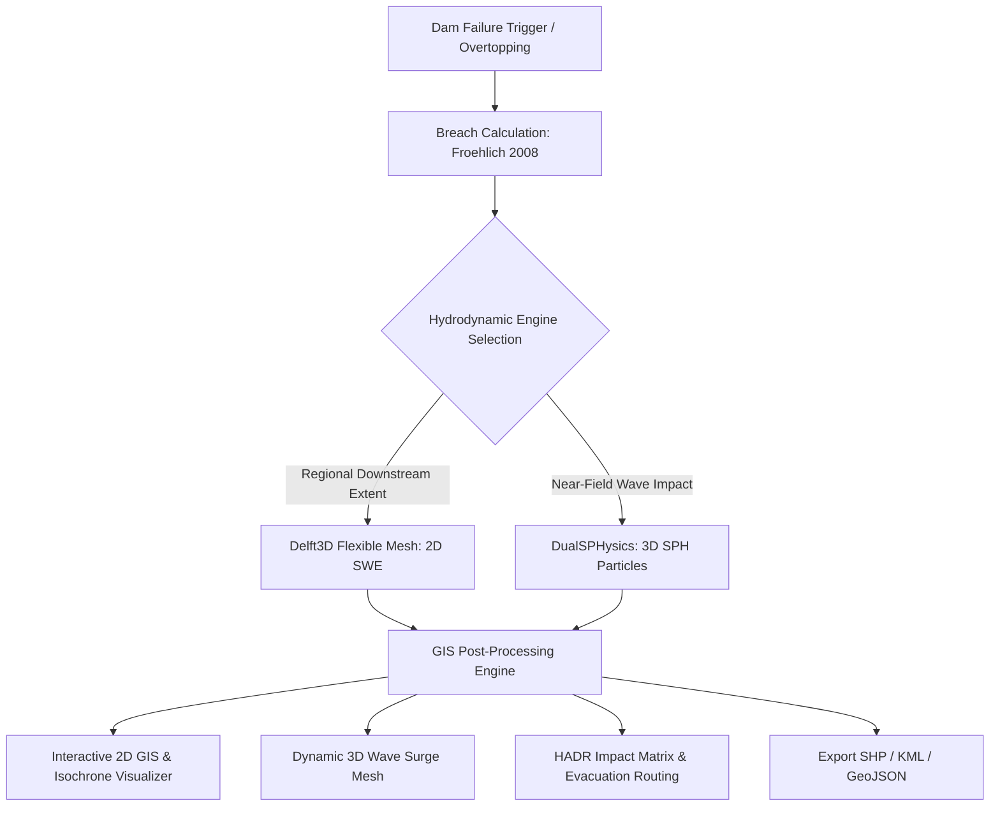

# 🌊 Dam Break Inundation Modelling — Complete Documentary & Technical Suite
### Smart India Hackathon 2026 — Problem Statement SIH26161
**"Dam Break Inundation Modelling Using Hydrodynamic Modelling of any River"**

---

## 📖 Welcome to the Project Documentary & Documentation Suite

This documentation repository provides an exhaustive, multi-dimensional record of the **Dam Break Inundation Modelling and Humanitarian Assistance & Disaster Relief (HADR) Decision Support System**. 

Whether you are an evaluator, hydrodynamic engineer, disaster management official, or software architect, this documentary details the complete story: from historical dam disasters across Indian river basins to cutting-edge 2D Flexible Mesh Shallow Water modeling and Smoothed Particle Hydrodynamics (SPH).

---

## 📚 Documentary & Technical Chapters

| Document | Title | Description |
| :--- | :--- | :--- |
| [PROJECT_DOCUMENTATION.md](./PROJECT_DOCUMENTATION.md) | **Master Technical Report** | The complete end-to-end technical documentation & SIH26161 submission report. |
| [01_PROJECT_DOCUMENTARY.md](./01_PROJECT_DOCUMENTARY.md) | **The Documentary: Simulating the Deluge** | The narrative documentary detailing the history, national imperative, scientific breakthroughs, engineering challenges, and human mission of this project. |
| [02_SYSTEM_ARCHITECTURE.md](./02_SYSTEM_ARCHITECTURE.md) | **System Architecture & Data Pipelines** | Detailed architectural diagrams, pipeline workflows, backend engine modules, and frontend GIS visualizers. |
| [03_HYDRODYNAMIC_MODELS.md](./03_HYDRODYNAMIC_MODELS.md) | **Hydrodynamic Formulations & Physics** | Mathematical rigor: Froehlich breach equations, St. Venant 2D Shallow Water Equations (SWE), and DualSPHysics SPH Lagrangian formulations. |
| [04_HADR_AND_DISASTER_MANAGEMENT.md](./04_HADR_AND_DISASTER_MANAGEMENT.md) | **HADR Protocols & Loss Estimation** | Disaster relief frameworks, casualty estimation formulas, infrastructure vulnerability matrices, relief camp zoning, and evacuation corridors. |
| [05_API_REFERENCE.md](./05_API_REFERENCE.md) | **FastAPI REST API Specification** | Complete interactive API endpoints, request/response schemas, JSON payloads, and error codes. |
| [06_DOCKER_DEPLOYMENT.md](./06_DOCKER_DEPLOYMENT.md) | **Containerization & Docker Hub Guide** | Step-by-step instructions for running via Docker Compose, unified Dockerfile, and publishing to Docker Hub (`docker push`). |
| [07_USER_MANUAL.md](./07_USER_MANUAL.md) | **Operator's Manual & User Guide** | Guided tour of the interactive dashboard: 2D GIS layer controls, 3D fluid wave surge, scenario comparison, and GIS data export. |
| [08_PITCH_DECK_AND_PRESENTATION_GUIDE.md](./08_PITCH_DECK_AND_PRESENTATION_GUIDE.md) | **Pitch Deck & Presentation Guide** | 13-slide pitch presentation blueprint, speaker scripts, visual layouts, jury Q&A defense, and AI prompt template. |

---

## ⚡ Quick Start with Docker

```bash
# 1. Clone or navigate to the repository
cd "Dam Flood Simulation"

# 2. Build and launch all services with Docker Compose
docker compose up --build -d

# 3. Access the interfaces
# Web Dashboard: http://localhost:3000
# FastAPI Docs:  http://localhost:8000/docs
# Healthcheck:   http://localhost:8000/api/health
```

---

## 🎯 Key Capabilities at a Glance



- **Dual-Engine Hydrodynamics**: Delft3D-FM 2D Shallow Water Equations for macro-catchment inundation + DualSPHysics SPH for micro-scale near-field hydrodynamic wave shock.
- **Parametric Breach Modeling**: Froehlich (2008) empirical breach width, side slope, and formation time computation.
- **Automated HADR Impact Analytics**: Instant detection of submerged roads, critical bridges, hospitals, and high-ground relief camp allocation.
- **Export Ready**: Instant generation of ESRI Shapefile zip archives, Google Earth KML files, and GeoJSON vectors.
- **Near-Real-Time Satellite EO Ready**: Embedded Copernicus Sentinel-1 SAR and Sentinel-2 MSI Google Earth Engine automated backscatter thresholding workflows.
